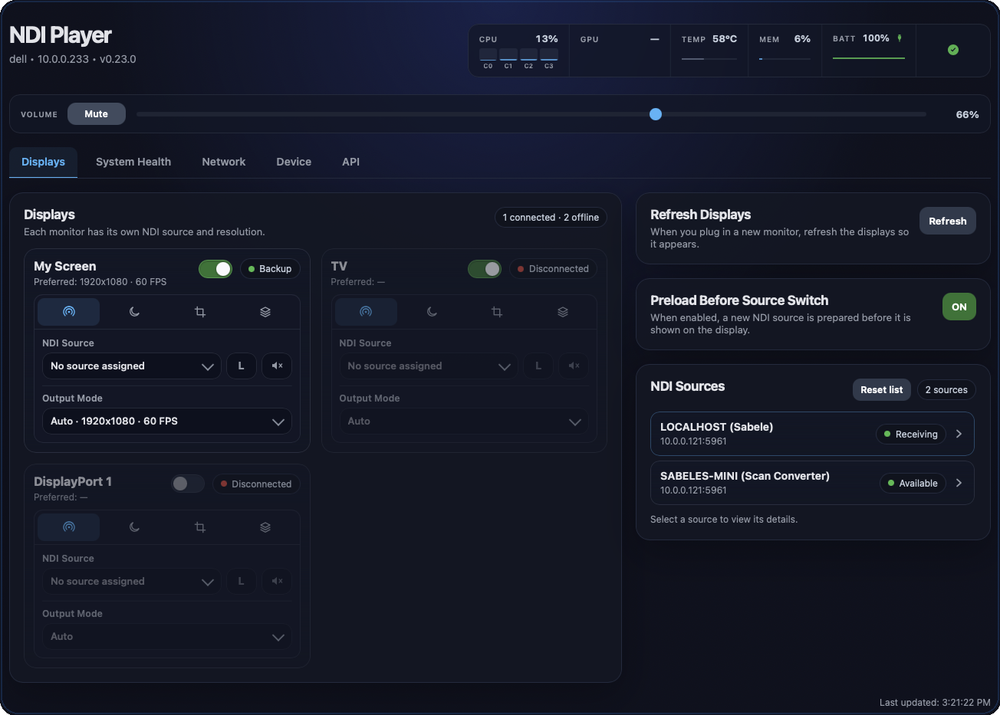
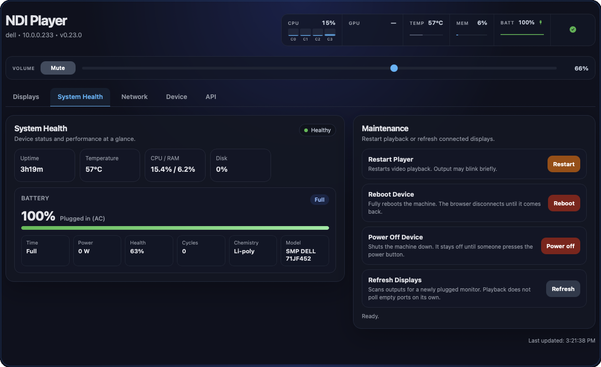
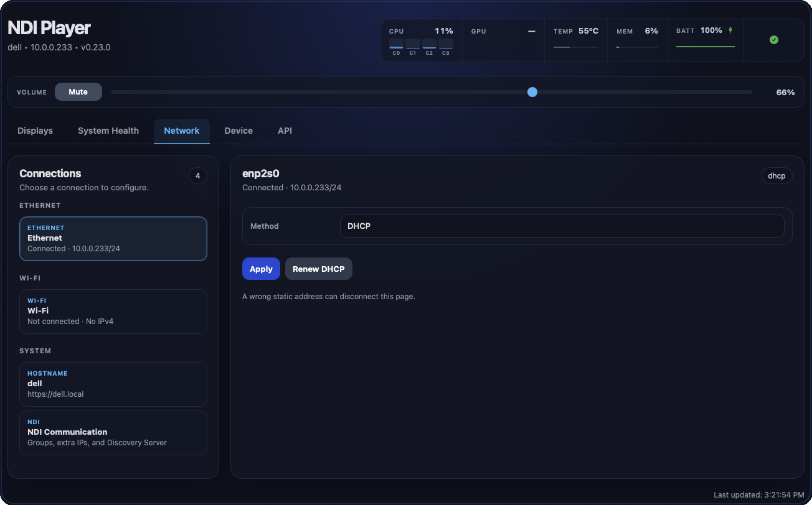
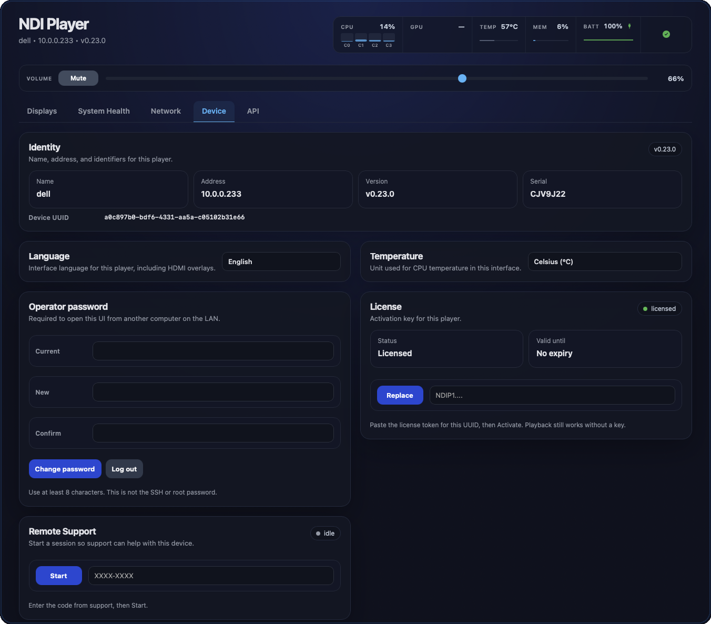
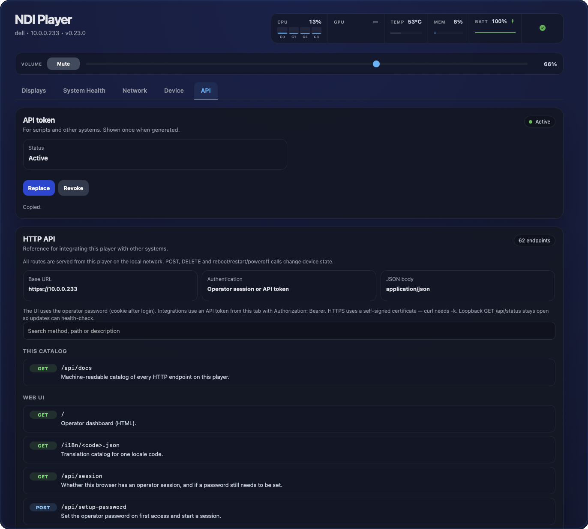
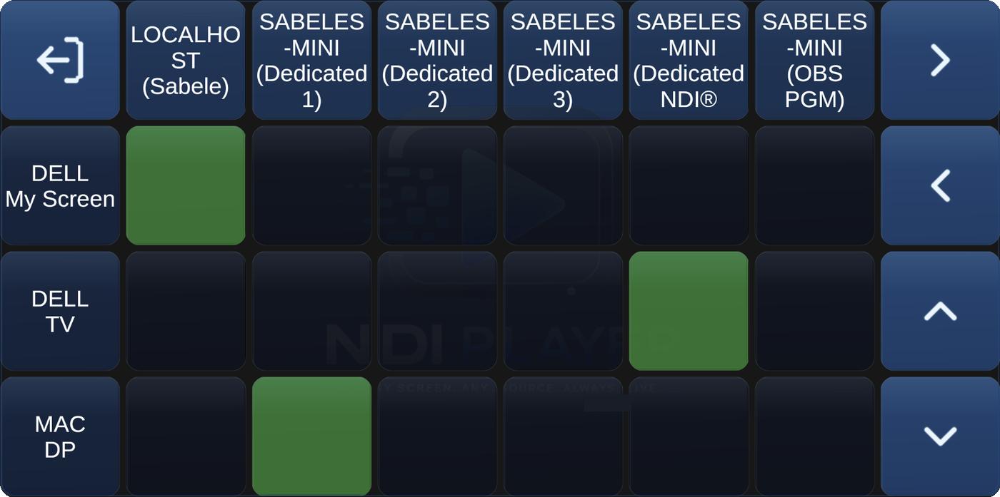

<p align="center">
  
</p>

<h1 align="center">NDI Player</h1>

<p align="center"><strong>Any screen. Any source. Always live.</strong></p>

Turn an ordinary PC into a dedicated [NDI](https://ndi.video/) video player.

Power it on. It finds sources on your network. Every screen in the room comes alive — no desktop, no login, no window to drag into place. A browser is the only remote you need.

NDI Player is built for control rooms, classrooms, houses of worship, studios, and any space that should show live video the moment the lights go on. One machine. One display or many. HDMI, DisplayPort, or a laptop panel. The same installer.

This project is **in active development**. If it does not work on your hardware, [open an issue](https://github.com/zabelez/ndi-player-releases/issues) with what you used and what you saw.

Current version: **0.23.0**.

## Open the UI

On first boot the screens start black. Press **SPACE** on a display to read the address.

Open `https://<player-ip>` or `https://<hostname>.local` and accept the self-signed certificate. The first visit sets an operator password.

The interface has five tabs: **Displays**, **System Health**, **Network**, **Device**, and **API**.

## Displays

<p align="center">
  
</p>

Each connected monitor has its own card. You can send a different NDI source to each screen (Full NDI, HX, HX2, and HX3).

On the card you can:

- **Name the output.** Click the title. That name appears on Displays, Device, the SPACE overlay, and Companion. Clear it to restore the default label (HDMI 1, Built-in Display, and so on).
- **Turn the head on or off** without unplugging the cable.
- **Pick the source**, then choose highest or lowest bandwidth and mute or unmute audio on that screen.
- **Set the output mode.** Auto uses the monitor’s preferred timing. You can also pick a listed mode or enter a custom width, height, frame rate, and progressive or interlaced scan.
- **Sleep the monitor** after 5, 10, 15, or 30 minutes with no NDI video, or leave sleep off.
- **Lay out the picture.** Crop, rotate, and fit (original, contain, stretch, cover) with a 3×3 alignment grid.
- **Set a backup** if the main source drops: a still image, a looping video, or another NDI source. You can set the delay, audio, fit, and alignment.

Next to the cards:

- **Preload** prepares the next source before it is shown, so the switch stays clean.
- **Refresh** scans for a newly plugged monitor.
- The **source list** shows format details after a short probe. Reset the list for a clean discovery. Saved sources can stay in the selector if they go offline for a moment.
- **Volume** in the header sets the equipment level and mute.

## System Health

<p align="center">
  
</p>

The header and this tab show CPU, RAM, GPU, disk, temperature, and uptime. Laptops also show battery.

From **Maintenance** you can restart playback, reboot the machine, power it off, or refresh displays.

## Network

<p align="center">
  
</p>

- **Ethernet** — DHCP or a fixed IPv4 address, gateway, and DNS.
- **Wi-Fi** — scan, connect, disconnect, or forget. Open and WPA2 networks. DHCP or a fixed address on the same adapter.
- **Hostname** — the name used for `https://<name>.local`. It must be unique on the LAN.
- **NDI Communication** — groups, extra IPs, an optional Discovery Server, and a toggle for sources running on this player. Apply restarts playback so the new discovery settings take effect.

## Device

<p align="center">
  
</p>

- **Identity** — hostname, address, version, serial, and Device UUID.
- **Language** — English, Portuguese (Brazil), French, or Dutch. The web UI and on-screen overlays follow this setting.
- **Temperature** — Celsius or Fahrenheit.
- **Operator password** — change it or log out. This is not the SSH or root password.
- **License** — email **contact@sysontech.com** with the Device UUID, paste the token, then Activate.
- **Remote support** — start a time-limited session with a one-time code from support.
- **Updates** — check for a signed update and apply it. See [Install and update](#install-and-update).
- **Hardware and software** — processor, memory, graphics, storage, OS, and kernel.

## API

<p align="center">
  
</p>

The **API** tab is for scripts and other systems, including Companion.

Generate a token here. It is shown once. Send it as `Authorization: Bearer`. The tab also lists every HTTP command on this player.

## Companion

<p align="center">
  
</p>

To route sources from a Stream Deck or other Companion surface, use the module in [ndi-player-companion](https://github.com/zabelez/ndi-player-companion). It is not in the Bitfocus store.

The module talks to up to eight players over HTTPS. Columns are NDI sources. Rows are the outputs on those players. A crosspoint sends that source to that output. Green is live. Click a green button again to clear that output. The arrows on the right scroll when there are more sources or outputs than buttons.

**Setup**

1. On each player, create a token under **API → API token**.
2. Download the module package from the [companion releases](https://github.com/zabelez/ndi-player-companion/releases).
3. In Companion 5: **Modules → Import module package**, then add an **NDI Player** connection.
4. Set **Module Version** to the version you imported, not **Dev version**.
5. Fill each slot with host or IP and API token. Leave a host empty to skip that slot.

**What you can do from Companion**

- Route any source to any output from the matrix page.
- Power off one player or all listed players.
- See hostname, CPU, RAM, and temperature. Colors change when load is high or a player is unreachable.
- Check for updates, update one player, or update every listed player that is behind.
- Rediscover NDI sources and rebuild the matrix.

The same release includes ready pages for matrix, power, health, CPU, memory, temperature, status, and auxiliary. Import a page and remap it to your NDI Player connection.

For module issues, use [ndi-player-companion](https://github.com/zabelez/ndi-player-companion/issues).

## Install and update

New machines install **0.22.0** from the USB image, then apply **0.23.0** from **Device → Updates**.

Do not use **Device → Updates** to reach 0.22.0 from an older version. That path does not apply 0.22.0 correctly. Write the ISO, boot from USB, and choose **Install NDI Player**. Installing erases the internal disk.

If the player is already on **0.22.0** or **0.22.1**, apply **0.23.0** from **Device → Updates**. You do not need another USB install. See [0.23.0](https://github.com/zabelez/ndi-player-releases/releases/tag/v0.23.0).

### New machine

1. Download **`ndi-player-0.22.0.iso`** and **`ndi-player-0.22.0.iso.sha256`** from [Releases](https://github.com/zabelez/ndi-player-releases/releases/tag/v0.22.0).
2. Verify the download:

   ```bash
   # Linux
   sha256sum -c ndi-player-0.22.0.iso.sha256

   # macOS
   shasum -a 256 -c ndi-player-0.22.0.iso.sha256
   ```

3. Write the image to a USB stick (Balena Etcher; Rufus **DD Image** on Windows).
4. Boot from USB. A 15-second menu appears. **Try NDI Player** (the default) does not change the internal disk. **Install NDI Player** erases it. If you do nothing, Try starts.
5. Connect network and a monitor. Press **SPACE** for the IP.
6. Open `https://<IP>`, set the operator password, then **Device → License**.
7. **Displays** — pick a source for each screen.

**Try is for evaluation, not for a show.** It runs from the USB stick and a temporary copy in memory, so playback is slower and less stable than after Install. Nothing from Try is saved.

## Downloads

| File | Purpose |
|------|---------|
| `ndi-player-0.22.0.iso` | Try or Install. **Install erases the target disk.** |
| `ndi-player-0.22.0.iso.sha256` | Verify the image |
| `ndi-player-0.23.0.tar.gz` | Update package (after a 0.22.0 or 0.22.1 install) |
| `ndi-player-0.23.0.tar.gz.sha256` | Verify the update package |

Companion packages are on [ndi-player-companion](https://github.com/zabelez/ndi-player-companion/releases), not on this repository.

## Talk to us

Questions, ideas, a PC that surprised you — [open an issue](https://github.com/zabelez/ndi-player-releases/issues).
